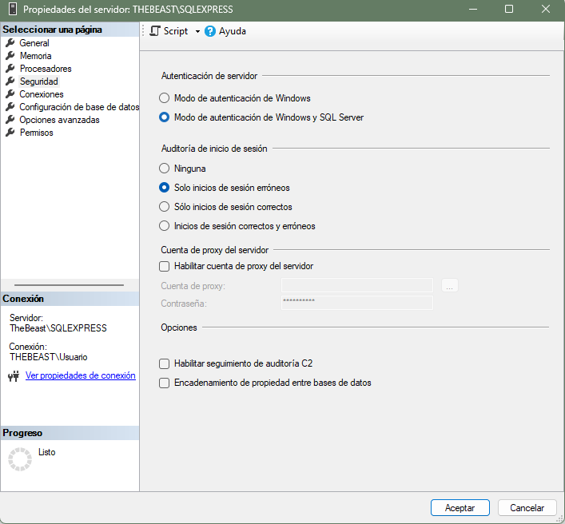
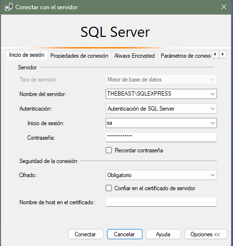
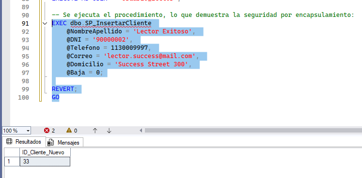
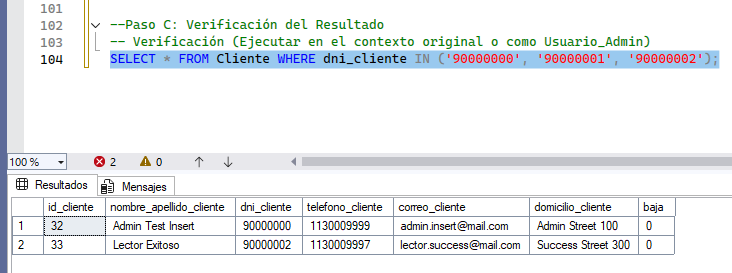
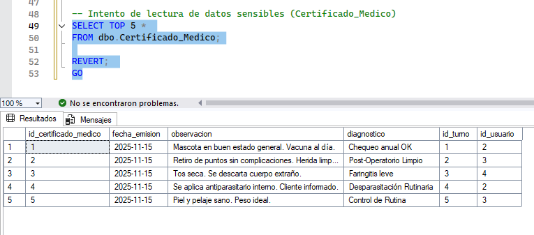
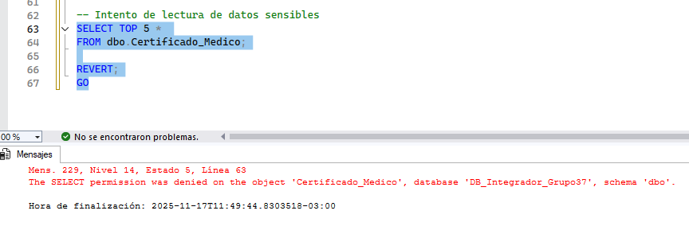

# TEMA 4: MANEJO DE PERMISOS A NIVEL DE USUARIOS DE BASE DE DATOS

**Este tema forma parte del Proyecto de Estudio e Investigación y tiene como objetivo analizar y aplicar los mecanismos de autorización en el Sistema de Gestión de Bases de Datos (DBMS), específicamente en SQL Server, garantizando la seguridad de acceso a la base de datos desarrollada para la clínica veterinaria.**

## I. Introducción Teórica: La Autorización en el DBMS

La **autorización** en SQL es el proceso de controlar qué identidades tienen permiso para realizar acciones sobre los objetos dentro de la base de datos. Esto se gestiona a nivel de **usuario** y **rol** de base de datos.

A diferencia de la autenticación (que verifica la identidad del usuario), la autorización define el alcance de las acciones permitidas (ej., leer datos sensibles, modificar la estructura de una tabla, ejecutar lógica de negocio). Este sistema es crucial para la seguridad, garantizando que solo los datos válidos y coherentes puedan ser manipulados.

### 1. Principios de Seguridad 

En la gestión de permisos a nivel de base de datos, los permisos se asignan a las siguientes entidades, conocidas como *principios de seguridad*:

1.  **Usuarios de Base de Datos:** Son las identidades individuales con acceso a la base de datos.
2.  **Roles:** Un **rol** es una colección lógica de privilegios que simplifica la administración, ya que permite otorgar o revocar permisos a un grupo en lugar de a usuarios individuales. Se utiliza la sentencia `CREATE ROLE` para definir nuevos roles de base de datos .

### 2. Principio de Mínimo Privilegio (PoLP)

La mejor práctica de seguridad, y la que guía este estudio, es el **Principio de Mínimo Privilegio**. Este principio dictamina que se debe otorgar a un usuario o rol solo los permisos estrictamente necesarios para que pueda realizar su tarea y nada más.

Los permisos se gestionan a través de comandos del Lenguaje de Control de Datos (DCL):

*   **`GRANT`**: Otorga permisos a un usuario o rol (ej., `GRANT SELECT ON Tabla TO Usuario`).
*   **`REVOKE`**: Retira permisos previamente otorgados.
*   **`DENY`**: Prohíbe explícitamente un permiso. Una denegación siempre tiene prioridad sobre una concesión explícita.

### 3. Seguridad por Encapsulamiento: El Rol del Procedimiento Almacenado

Un aspecto fundamental que se explora en el Tema 4 es cómo los **Procedimientos Almacenados** (P.A.) refuerzan la seguridad.

Los P.A. son bloques de código SQL almacenados en el DBMS que encapsulan lógica de negocio. Una de sus ventajas cruciales es la **seguridad**. En lugar de otorgar a un usuario permisos directos de manipulación de datos (`INSERT`, `UPDATE`, `DELETE`) sobre una tabla, se le otorga únicamente el permiso de **`EXECUTE`** sobre el procedimiento almacenado.

Esto permite al usuario ejecutar la lógica de negocio (ej., insertar un cliente) sin tener acceso directo a la tabla `Cliente`, demostrando un aislamiento efectivo entre el usuario y los datos subyacentes, lo cual es la base de la prueba práctica en este tema.

## Transición a la Aplicación Práctica

En las siguientes etapas se implementarán estos conceptos en un entorno real de SQL Server, mediante la creación de usuarios y roles utilizando sentencias `GRANT`, `REVOKE` y `CREATE ROLE`, y la aplicación de permisos sobre las tablas del esquema de la clínica veterinaria (como `Cliente`, `Mascota` o `Certificado_Medico`), con el fin de verificar el comportamiento de cada caso y validar el Principio de Mínimo Privilegio.


## II. DESARROLLO DEL TEMA: IMPLEMENTACIÓN PRÁCTICA

Esta sección detalla la configuración del entorno, la creación de usuarios, la definición de roles y la verificación del comportamiento de los permisos en el contexto de la base de datos de la clínica veterinaria.

### FASE 2: Manejo de Permisos a Nivel de Usuarios (Seguridad por Encapsulamiento)

El objetivo de esta fase es demostrar que un usuario con privilegios mínimos (solo lectura) puede realizar operaciones DML (escritura) si se le otorga explícitamente el permiso de ejecución sobre un procedimiento almacenado.

#### 2.1. Configuración de Autenticación y Verificación de Entorno

Se verifica que el entorno del DBMS (SQL Server) esté configurado para permitir la autenticación de usuarios de base de datos (`SQL Server authentication`), además de la autenticación integrada con Windows. Esta configuración es conocida como **Modo Mixto**, y es indispensable para poder crear los `Logins` y `Users` necesarios para las pruebas de permisos .





#### 2.2. Creación de Logins y Usuarios

Se crean dos *Logins* (a nivel de servidor) y dos *Usuarios* (a nivel de base de datos), que serán utilizados para la prueba: uno con permisos de administrador (`Usuario_Admin`) y otro con privilegios mínimos (`Usuario_Lector`).

```sql
USE DB_Integrador_Grupo37;
GO

-- 1. Creación de Logins (Inicios de Sesión) en la instancia SQL Server
CREATE LOGIN Login_Admin WITH PASSWORD = 'AdminPass123!', CHECK_POLICY = OFF;
CREATE LOGIN Login_Lector WITH PASSWORD = 'LectorPass123!', CHECK_POLICY = OFF;

-- 2. Creación de Usuarios de Base de Datos mapeados a los Logins
CREATE USER Usuario_Admin FOR LOGIN Login_Admin;
CREATE USER Usuario_Lector FOR LOGIN Login_Lector;

#### 2.3. Asignación del Mínimo Privilegio

Se otorgan los permisos necesarios para cada usuario: Usuario_Admin obtiene control total, mientras que Usuario_Lector obtiene solo el permiso de lectura (SELECT) sobre la tabla de prueba (Cliente).
-- 3. Otorgar permiso de Administrador total sobre la BD
GRANT CONTROL TO Usuario_Admin;

-- 4. Otorgar permiso de SÓLO LECTURA (SELECT) sobre la tabla Cliente
GRANT SELECT ON OBJECT::dbo.Cliente TO Usuario_Lector;

#### 2.4. Pruebas de Inserción Directa (Fallo por Mínimo Privilegio)
Se verifica que la restricción de seguridad funciona, intentando realizar una inserción directa (INSERT) sobre la tabla Cliente desde la sesión del Usuario_Lector.
-- PRUEBA 2: INSERT DIRECTO CON USUARIO_LECTOR (DEBE FALLAR)
EXECUTE AS USER = 'Usuario_Lector';

-- Intento de inserción directa (se espera un error de permiso)
INSERT INTO dbo.Cliente (nombre_apellido_cliente, dni_cliente, telefono_cliente, correo_cliente, domicilio_cliente, baja)
VALUES ('Lector Fallido', '90000001', 1130009998, 'lector.fail@mail.com', 'Fail Street 200', 0);

REVERT;
GO
```


--------------------------------------------------------------------------------
#### 2.5. Prueba de Seguridad por Encapsulamiento
```sql
Se otorga el permiso de ejecución (EXECUTE) sobre el procedimiento almacenado (SP_InsertarCliente), que realiza la misma operación de inserción.
-- 5. OTORGAR PERMISO DE EXECUTE SOBRE EL PROCEDIMIENTO ALMACENADO
-- Se permite al Usuario_Lector ejecutar el código encapsulado.
GRANT EXECUTE ON OBJECT::dbo.SP_InsertarCliente TO Usuario_Lector;
GO

-- PRUEBA 3: INSERT VÍA P.A. CON USUARIO_LECTOR (DEBE FUNCIONAR)
EXECUTE AS USER = 'Usuario_Lector';

-- Ejecución del procedimiento almacenado:
EXEC dbo.SP_InsertarCliente 
    @NombreApellido = 'Lector Exitoso', 
    @DNI = '90000002', 
    @Telefono = 1130009997, 
    @Correo = 'lector.success@mail.com', 
    @Domicilio = 'Success Street 300', 
    @Baja = 0;

REVERT;
GO
```





--------------------------------------------------------------------------------
### FASE 3: Manejo de Permisos a Nivel de Roles del DBMS

Esta fase implementa un caso práctico para la gestión de permisos a través de **Roles de Base de Datos**. El uso de roles permite otorgar o revocar permisos a múltiples usuarios de manera centralizada, reforzando la seguridad y el mantenimiento. La prueba se realiza sobre la tabla **`Certificado_Medico`**, la cual contiene información sensible de diagnóstico .

#### 3.1. Creación de Roles y Asignación de Permisos

Se crea el rol `Rol_Lector` y se le otorga el permiso `SELECT` sobre la tabla sensible. Luego, solo `Usuario_a` es agregado como miembro del rol.

```sql
USE DB_Integrador_Grupo37;
GO

-- 1. Crear logins y usuarios de prueba
CREATE LOGIN Login_a WITH PASSWORD = 'Jose123', CHECK_POLICY = OFF;
CREATE USER Usuario_a FOR LOGIN Login_a;
CREATE LOGIN Login_b WITH PASSWORD = 'Jorge456', CHECK_POLICY = OFF;
CREATE USER Usuario_b FOR LOGIN Login_b;

-- 2. Creacion del rol
CREATE ROLE Rol_Lector; 

-- 3.Otorgar permiso SELECT al rol
GRANT SELECT ON OBJECT::dbo.Certificado_Medico TO Rol_Lector;

-- 4.Asignar el rol a un usuario 
ALTER ROLE Rol_Lector ADD MEMBER Usuario_a;
3.2. Verificación del Comportamiento por Pertenencia al Rol
Se ejecuta la misma consulta SELECT bajo el contexto de ambos usuarios para demostrar la herencia de privilegios.
-- PRUEBA A SELECT CON Usuario_a  - DEBE FUNCIONAR
EXECUTE AS USER = 'Usuario_a';
SELECT TOP 5 * FROM dbo.Certificado_Medico;
REVERT; 
GO
```
--------------------------------------------------------------------------------


 Descripción: Captura de pantalla que muestra la ejecución exitosa de la consulta SELECT por parte del Usuario_a, confirmando que los permisos se heredan correctamente a través del Rol_Lector.

--------------------------------------------------------------------------------

```sql
-- PRUEBA B: SELECT CON USUARIO_b (NO MIEMBRO DEL ROL) - DEBE FALLAR
EXECUTE AS USER = 'Usuario_b';
SELECT TOP 5 * FROM dbo.Certificado_Medico;
REVERT;
GO
```


Descripción: Captura de pantalla del mensaje de error de SQL Server, verificando que Usuario_b no puede acceder a la tabla Certificado_Medico por carecer del permiso SELECT, ya que no es miembro del rol. Esto demuestra la correcta aplicación de las restricciones de acceso por rol.

--------------------------------------------------------------------------------
